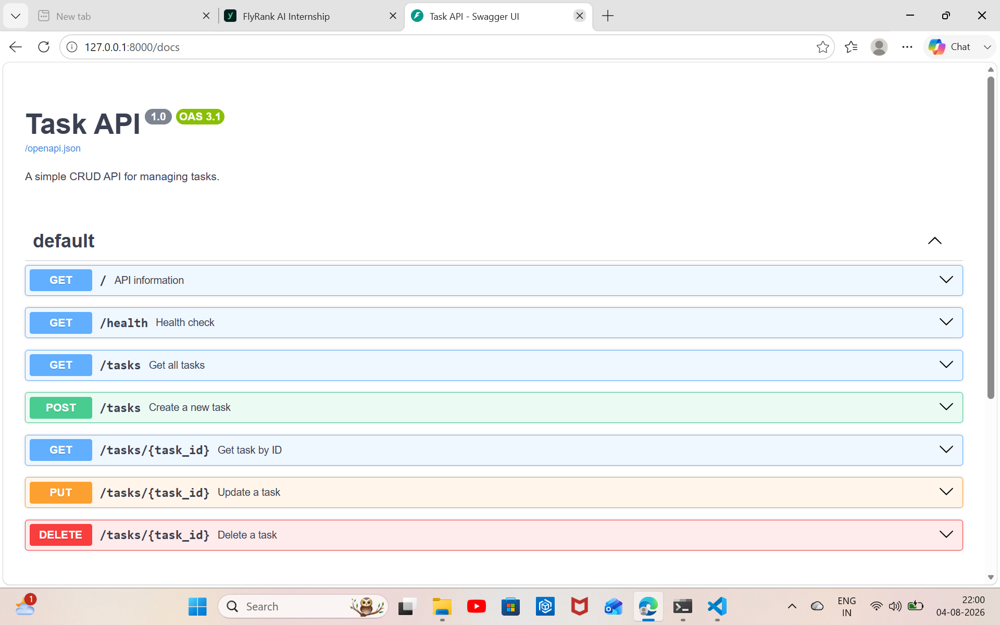

# Task API - FlyRank Backend AI Engineering

A simple CRUD API built with **FastAPI** and **SQLite** as part of the FlyRank Backend AI Engineering internship assignment.

This API manages a to-do task list and supports the four main CRUD operations:

* Create tasks
* Read tasks
* Update tasks
* Delete tasks

The application uses **SQLite** for persistent data storage. Tasks are stored in `tasks.db` and remain available even after the server is restarted.

---

## 🚀 Tech Stack

* Python 3.13
* FastAPI
* Uvicorn
* Pydantic
* SQLite
* Swagger UI (OpenAPI Documentation)

---

## 📌 Features

✅ Create new tasks
✅ View all tasks
✅ View a single task by ID
✅ Update existing tasks
✅ Delete tasks
✅ Input validation
✅ Proper HTTP status codes
✅ Persistent data using SQLite
✅ Automatic database and table creation
✅ Interactive Swagger documentation

---

## 📂 Project Structure

```text
task-api/
│
├── main.py
├── tasks.db
├── requirements.txt
├── README.md
├── .gitignore
│
└── screenshots/
    ├── swagger-ui.png
    └── database-screenshot.png
```

> `tasks.db` is automatically created when the application starts if it does not already exist.

---

# ⚙️ Installation & Setup

## 1. Clone the repository

```bash
git clone https://github.com/thillaieswari26/Flyrank-ai-internship.git
```

## 2. Navigate to the project directory

```bash
cd flyrankai/week2/assignment1/task-api
```

## 3. Create a virtual environment

```bash
py -m venv venv
```

## 4. Activate the virtual environment

Windows PowerShell:

```powershell
.\venv\Scripts\Activate.ps1
```

## 5. Install dependencies

```bash
pip install -r requirements.txt
```

---

# ▶️ Run the Application

Start the FastAPI server:

```bash
uvicorn main:app --reload
```

The API will run at:

```text
http://127.0.0.1:8000
```

Swagger UI documentation:

```text
http://127.0.0.1:8000/docs
```

---

# 📌 API Endpoints

| Method | Endpoint           | Description       | Status Code   |
| ------ | ------------------ | ----------------- | ------------- |
| GET    | `/`                | API information   | 200           |
| GET    | `/health`          | Health check      | 200           |
| GET    | `/tasks`           | Get all tasks     | 200           |
| GET    | `/tasks/{task_id}` | Get task by ID    | 200, 404      |
| POST   | `/tasks`           | Create a new task | 201, 400      |
| PUT    | `/tasks/{task_id}` | Update a task     | 200, 400, 404 |
| DELETE | `/tasks/{task_id}` | Delete a task     | 204, 404      |

---

# 🧪 API Testing Examples

## Create Task

### Request

```bash
curl -X POST "http://127.0.0.1:8000/tasks" \
-H "Content-Type: application/json" \
-d "{\"title\":\"Learn SQL\"}"
```

### Response

```json
{
  "id": 4,
  "title": "Learn SQL",
  "done": false
}
```

## Update Task

### Request

```json
{
  "title": "Learn SQL and SQLite",
  "done": true
}
```

### Response

```json
{
  "id": 4,
  "title": "Learn SQL and SQLite",
  "done": true
}
```

## Delete Task

### Request

```text
DELETE /tasks/4
```

### Response

```text
204 No Content
```

---

# 🗄️ SQLite Database

This project uses **SQLite** instead of in-memory storage.

SQLite was chosen because it:

* Is lightweight and easy to use
* Requires no separate database server
* Stores the database in a single file
* Provides real SQL-based persistent storage

The database is stored in:

```text
tasks.db
```

When the application starts:

1. The `tasks.db` file is created automatically if it does not exist.
2. The `tasks` table is created automatically if it does not exist.
3. Three example tasks are inserted only when the table is empty.

The database schema is:

| Column  | Type    | Description       |
| ------- | ------- | ----------------- |
| `id`    | INTEGER | Primary key       |
| `title` | TEXT    | Task title        |
| `done`  | BOOLEAN | Completion status |

---

# 🔍 SQL Queries Explored

The following SQL queries were executed using **DB Browser for SQLite**:

### List every task

```sql
SELECT * FROM tasks;
```

### Show completed tasks

```sql
SELECT * FROM tasks WHERE done = 1;
```

### Count all tasks

```sql
SELECT COUNT(*) FROM tasks;
```

### Mark every task as completed

```sql
UPDATE tasks SET done = 1;
```

### Delete all completed tasks

```sql
DELETE FROM tasks WHERE done = 1;
```

---

# 📸 Database Screenshot

The SQLite database was inspected using DB Browser for SQLite.


---

# 📖 Swagger UI

The API provides interactive documentation using Swagger UI.

Swagger UI can be used to test all CRUD operations directly from the browser.



---

# 🔄 Data Persistence

Unlike the previous in-memory implementation, this version stores tasks in SQLite.

For example:

1. Create a new task using `POST /tasks`.
2. Stop the FastAPI server.
3. Start the server again.
4. Run `GET /tasks`.

The task remains available because it is stored in `tasks.db`.

---

# 📝 Notes

* The API maintains the same CRUD endpoints as the previous assignment.
* SQLite is used as the persistent data layer.
* The database and table are created automatically.
* Example tasks are inserted only during the first initialization.
* SQL operations are performed using Python's built-in `sqlite3` module.
* FastAPI automatically generates the Swagger/OpenAPI documentation.

---

# 👩‍💻 Author

**Thillai Eswari T**

Backend AI Engineering Intern
FlyRank
